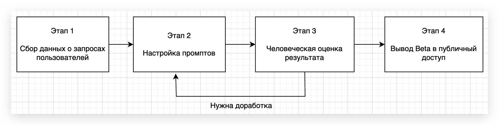

# ML System Design Doc - [RU]
## Дизайн ML системы - LiveCodingAI - MVP v0.1

*Шаблон ML System Design Doc от телеграм-канала [Reliable ML](https://t.me/reliable_ml)*   

- Рекомендации по процессу заполнения документа (workflow) - [здесь](https://github.com/IrinaGoloshchapova/ml_system_design_doc_ru/blob/main/ML_System_Design_Doc_Workflow.md).  
- Детальный доклад о том, что такое ML System Design Doc и о том, как, когда и зачем его составлять - [тут](https://www.youtube.com/watch?v=PW9TGNr1Vqk).
    
> ## Термины и пояснения
> - Итерация - это все работы, которые совершаются до старта очередного пилота  
> - БТ - бизнес-требования 
> - EDA - Exploratory Data Analysis - исследовательский анализ данных  
> - `Product Owner`,  `Data Scientist` - роли, которые заполняют соответствующие разделы 
> - В этом шаблоне роль `Data Scientist` совмещает в себе компетенции классического `Data Scientist` с упором на исследования и `ML Engineer` & `ML Ops` роли с акцентом на продуктивизацию моделей
> - Для вашей организации распределение ролей может быть уточнено в зависимости от операционной модели 

### 1. Цели и предпосылки 
#### 1.1. Зачем идем в разработку продукта?  

- Бизнес-цель `Product Owner`  

Бизнес цель - сделать учебу IT специалистов проще и эффективнее. Создать платформу, которая ускорит обучение программированию через интерактивную симуляцию Live Coding. Монетизация за счет премиум подписок.

- Почему станет лучше, чем сейчас, от использования ML `Product Owner` & `Data Scientist`  

Обычно преподаватели обозревают уже готовый код при разборе новой темы. Но исследования показали, что ученики лучше понимают алгоритмы и логику темы через Live Coding, поэтому возможность "оживить" любой код с помощью ML повысит вовлеченность учащихся и ускорит обучение без потери качества.

- Что будем считать успехом итерации с точки зрения бизнеса `Product Owner`  

MVP с 100 активных пользователей, среднее время использования больше или равно 10 минут.

#### 1.2. Бизнес-требования и ограничения  

- Краткое описание БТ и ссылки на детальные документы с бизнес-требованиями `Product Owner`  

Ключевой функционал из БТ: 
1) импорт кода пользователя / указание ссылки на GitHub репозиторий / укаание темы для разбора
2) генерация объяснения кода через LLM
3) генерация мини практических заданий на разобранную тему
4) проверка кода от пользователя в SandBox

- Бизнес-ограничения `Product Owner` 

1) Бюджет MVP < 50к руб.
2) Запуск до 01 июня 2026 года

- Что мы ожидаем от конкретной итерации `Product Owner`. 

Рабочий MVP с end-to-end симуляцией Live Coding. Персонализация базовая - в рамках сессии.

- Описание бизнес-процесса пилота, насколько это возможно - как именно мы будем использовать модель в существующем бизнес-процессе? `Product Owner`    

Бизнес процесс: 
1) пользователь импортирует код / указывает репозиторий или тему
2) получает симуляцию Live Coding с мини заданиями по ходу рассказа
3) выполняет мини задания
4) при желании, отматывает симуляцию назад с комментарием

Модель является ключевой функцией EdTech продукта.

- Что считаем успешным пилотом? Критерии успеха и возможные пути развития проекта `Product Owner`

Критерии успешного пилота:
1) \>70% task completion
2) NPS >= 5

Пути развития:
1) Переход на open source модель
2) Дообучение на объяснениях успешных преподавателей
3) Добавленеи долгосрочной памяти об успехах пользователей

#### 1.3. Что входит в скоуп проекта/итерации, что не входит   

- На закрытие каких БТ подписываемся в данной итерации `Data Scientist`  

1) Импорт / парсинг кода
2) LLM симуляция Live Coding
3) Генерация и проверка мини заданий
4) Память в рамках сессии

- Что не будет закрыто `Data Scientist`  

1) Долгосрочная память о пользователе

- Описание результата с точки зрения качества кода и воспроизводимости решения `Data Scientist` 

GitHub репозиторий с Docker-Compose, requirements. LLM не будет на 100% воспроизводима.

- Описание планируемого технического долга (что оставляем для дальнейшей продуктивизации) `Data Scientist`  

1) неоптимизированный inference (batch size = 1)
2) отсутствие CI/CD
3) отсутствие долгосрочной памяти 

#### 1.4. Предпосылки решения  

- Описание всех общих предпосылок решения, используемых в системе – с обоснованием от запроса бизнеса: какие блоки данных используем, горизонт прогноза, гранулярность модели, и др. `Data Scientist`  

Данные:
1) код от пользователя / ссылка на репозиторий / произвольная тема
2) решение мини задания
3) прерывание симуляции и комментарий к продолжению

Модель - OpenAI API GPT 5.2
Горизонт - real time

### 2. Методология `Data Scientist`     

#### 2.1. Постановка задачи  

- Что делаем с технической точки зрения: рекомендательная система, поиск аномалий, прогноз, оптимизация, и др. `Data Scientist`  

1) LLM генерацию объяснений кода (step-by-step симуляция Live Coding)
2) LLM генерация мини заданий
3) LLM проверка выполнения кода в SandBox
4) RAG для работы с кодом пользователя и объяснения по теоретическому материалу (книги, статьи и прочему)

#### 2.2. Блок-схема решения

- Блок-схема для бейзлайна и основного MVP с ключевыми этапами решения задачи: подготовка данных, построение прогнозных моделей, оптимизация, тестирование, закрытие технического долга, подготовка пилота, другое. `Data Scientist`  

#### 2.3. Этапы решения задачи `Data Scientist`  

*Этап 1 - Сборка данных о запросах пользователей*  

| Название данных            | Источник                                                 | Ресурс        | Цель                         |
| -------------------------- | -------------------------------------------------------- | ------------- | ---------------------------- |
| Примеры кода пользователей | Мои notebooks + 10-20 GitHub репозиториев коллег | Manual upload | Реальные сценарии для оценки |
| RAG документы              | Python docs / статьи                                  | Web scraping  | Снижение галюцинаций      |
| Тестовые темы              | "web app", "ML model", "data pipeline"                   | Manual list   | Разнообразие                 |
 
MVP:
- Формирование выборки: собранные вручную 20 ноутбуков и 10 репозиториев о различных темах.
- Горизонт / гранулярность: разовая сборка, гранула - 1 ноутбук или репозиторий
- Целевая переменная: датасет из ноутбука/репозитория и запроса
- Метрики: покрытие типичных сценариев > 80%
- Необходимый результат: 20 ноутбуков и 10 репозиториев
- Риски: низкое разнообразие
- Бизнес-проверка: владелец продукта оценивает все данные на репрезентативность

> Чаще всего заполнение раздела невозможно без EDA.

 *Этап 2 - Настройка промптов*
 
MVP:
- Формирование выборки: на 10 ноутбуков и 5 репозиториев генерируется по 5 симуляций - получается 75 примеров.
- Горизонт / гранулярность: реальное время (по шагово)
- Целевая переменная: human quality score (по Этапу 3)
- Метрики: процент полноты (согласно рекомендациям к промпту от OpenAI) 
- Необходимый результат: промпт, с которым достигается максимальная целевая переменная
- Риски: нехватка Prompt Engineering для достижения хорошего качества
- Бизнес-проверка: отсутствует

 *Этап 3 - Человеческая оценка и итерации*
 
MVP:
- Формирование выборки: к прошлой выборке прибавляется оценка симуляции и заданий от рецензентов. \
- Горизонт / гранулярность: разовая проверка \
- Целевая переменная: human quality score (1-5) \
- Метрики: 

| Критерий     | Target MVP | Бизнес-связь          |
|--------------|------------|-----------------------|
| **Полнота**  | >4.0       | Наскольк раскрыта тема    |
| **Понятность** | >4.3     | Объяснения доступны   |
| **Логичность** | >4.0     | Логичность обучения         |
| **Задания**  | >4.0       | Качестов практических заданий      |

- Необходимый результат: промпт, с которым средний human quality score > 4
- Риски: средний human quality score < 4
- Бизнес-проверка: Human Quality Score > 4, общение с тестировщиками.

 *Этап 4 - Вывод beta в публичный доступ*
 
MVP:
- Формирование выборки: 100 уникальных пользователей.
- Горизонт / гранулярность: online мониторинг
- Целевая переменная: вовлеченность пользователей и удолетворенность
- Метрики: 

| Метрика     | Target | Бизнес-связь          |
|--------------|------------|-----------------------|
| **Успешность end-to-end**  | >60%       | Ключевая ценность    |
| **Полезность заданий** | > 50%     | Польза от мини-заданий   |
| **NPS** | >5.0     | Удовлетворенность продуктом         |
| **Задержка сервиса**  | <4s       | Время ожидания      |

- Необходимый результат: стабильный сервис
- Риски: DDoS атака сервиса, неудачный UX
- Бизнес-проверка: ежедневный мониторинг метрик, оценка письменного/устного фидбека
  
### 3. Подготовка пилота  
  
#### 3.1. Способ оценки пилота  
  
- Краткое описание предполагаемого дизайна и способа оценки пилота `Product Owner`, `Data Scientist` with `AB Group` 

Open Beta с количество уникальных пользователей больше 30, собранные логи использования и больше 30 форм с фидбеком.
  
#### 3.2. Что считаем успешным пилотом  
  
- Формализованные в пилоте метрики оценки успешности `Product Owner`   
  
80% симуляций отработали end-to-end, NPS > 5, 30+ собранных фидбеков

#### 3.3. Подготовка пилота  
  
- Что можем позволить себе, исходя из ожидаемых затрат на вычисления. Если исходно просчитать сложно, то описываем этап расчетов ожидаемой вычислительной сложности на эксперименте с бейзлайном. И предусматриваем уточнение параметров пилота и установку ограничений по вычислительной сложности моделей. `Data Scientist` 

    - OpenAI API
    - не более 10 пользователей одновременно
    - деплой на Yandex Cloud

### 4. Внедрение `для production систем, если требуется`    
#### 4.1. Архитектура решения   
  
- Блок схема и пояснения: сервисы, назначения, методы API `Data Scientist`  
  
Пока неизвестно.

#### 4.2. Описание инфраструктуры и масштабируемости 
  
- Какая инфраструктура выбрана и почему `Data Scientist` 

1) Деплой - Yandex Cloud. Просто, хорошо поддерживается.
2) Модель - OpenAI API.  
3) База данных - Yandex Combo. Низкая сложность, соответствует требованиям ФЗ-152 о хранении персональных данных.

- Плюсы и минусы выбора `Data Scientist` 

Плюсы:
1) Локальная инфраструктура
2) Yandex Combo оптимизирован для векторного поиска и реляционных данных
3) Yandex соответсвует требованиям ФЗ о персональных данных
4) Модель от OpenAI является одной из лучших по качеству

Минусы:
1) Не самый дешевый сервис
2) OpenAI API не очень доступна по оплате

- Почему финальный выбор лучше других альтернатив `Data Scientist` 

Платформа Yandex оптимальна по решаемым ею проблемам, а LLM от OpenAI должна достойно справляться с объяснением кода. 

  
#### 4.3. Требования к работе системы  
  
- SLA, пропускная способность и задержка `Data Scientist` 

Средняя задержка меньше 4 секунд. Не более 20 одновременных запросов.
  
#### 4.4. Безопасность системы  
  
- Потенциальная уязвимость системы `Data Scientist`  

1) Слив Yandex ключа
2) Code Injection в SandBox
3) DDoS атаки Yandex
  
#### 4.5. Безопасность данных   
  
- Нет ли нарушений GDPR и других законов `Data Scientist`  

Нарушений нет:
1) данные анонимируются перед отправкой в OpenAI API
2) пользователь дает согласие на обработку данных
3) Yandex Cloud сертифицирован по 152-ФЗ
4) Yandex Combo: шифрование данных
5) Логи доступа - 1 год
  
#### 4.6. Издержки  
  
- Расчетные издержки на работу системы в месяц `Data Scientist`  

Затраты:
    1) OpenAI GPT-4o (например) - 200 сессий (50к токенов) - 1580 руб.
    2) Yandex Cloud - 30 пользователей - 1200 руб.
    3) Yandex Combo - 1600 руб.
  
#### 4.7. Integration points  
  
- Описание взаимодействия между сервисами (методы API и др.) `Data Scientist`  
  
Пока неизвестно.

#### 4.8. Риски  
  
- Описание рисков и неопределенностей, которые стоит предусмотреть `Data Scientist`   

1) ограничение кол-ва запросов к OpenAI API
2) оптимизация RAG процесса
3) соблюдение законодательства в хранении данных и работе с ними в LLM